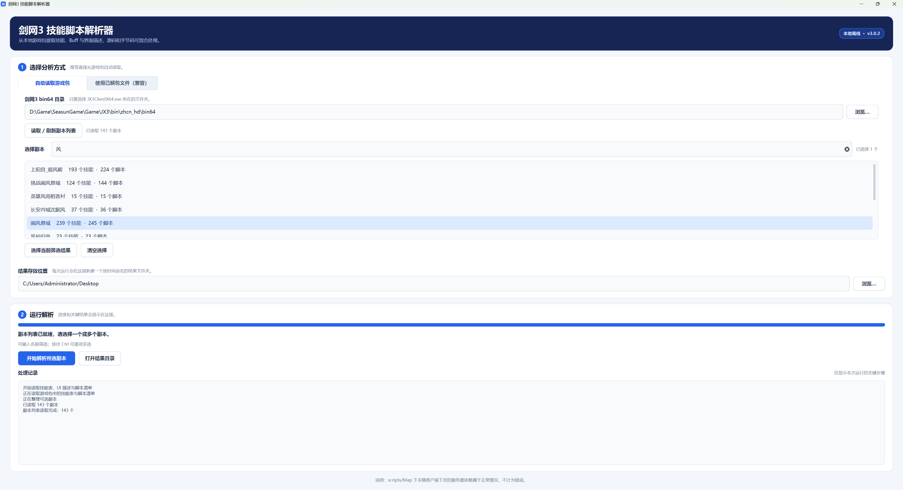

# 剑网3技能脚本解析器 3.0.2

这是旧版 `ngb.py` 的重做版。它按每个技能脚本的真实文件内容判断格式，兼容普通 Lua 源码和标准 Lua 字节码；字节码会先离线反编译，再使用不依赖局部变量名的规则提取技能效果。3.0 版把 PakV4 解包、可选副本发现、技能 ID 汇总和脚本提取全部接入程序，通常不再需要手工制作解包清单或技能 ID 文件。

> 本仓库只提供源码、测试和构建脚本，不提供任何预编译 EXE、游戏数据或解包结果。请自行审阅并在本机完成构建。

<p align="center">
  
</p>

## 直接使用 EXE

1. 双击 `JX3SkillAnalyzer.exe`。
2. 在“自动读取游戏包”页选择 `JX3ClientX64.exe` 所在的 `bin64` 目录。
3. 点击“读取 / 刷新副本列表”，搜索并选择一个或多个副本。
4. 确认结果存放位置，然后点击“开始解析所选副本”。程序会自动新建形如 `技能解析_2026-08-30_12-34-56` 的运行目录；同一秒重复运行会追加 `_02`、`_03`，不会覆盖旧结果。

程序会直接从游戏 PakV4 中读取并缓存以下基础数据：

- `settings/skill/skills.tab`
- `settings/skill/buff.tab`
- `ui/Scheme/Case/skill.txt`
- `ui/Scheme/Case/buff.txt`
- `scripts/ScriptList.tab`

随后根据所选副本自动汇总 `skills.tab` 中的技能 ID，解出该副本文件夹内的全部脚本以及共享 Include，再调用解析器。为了严格复现游戏 DLL 的加载环境，程序会把内置解包组件以随机临时文件名放入所选 `bin64`，任务结束后立即删除；玩家不需要手工复制或运行它，解出的文件也不会散落在游戏目录。

“使用已解包文件（兼容）”页保留了原有流程：仍可手工选择解包根目录和技能 ID 文本。

`示例技能ID.txt` 同时包含“一之窟”源码技能、带 UI 描述的 Buff 关联，以及一个“阆风悬城”字节码技能，可用于快速验证。

## 结果文件

下面的文件都位于本次运行自动创建的时间目录中，不会直接散落在桌面或用户选择的父目录里。

- `技能解析.csv`：技能配置、UI名称/描述、伤害与控制类型、读条/引导、范围、Buff关联等主结果。
- `关联Buff.csv`：每个技能引用的 Buff，以及 `buff.tab` 和 UI `buff.txt` 中的名称、描述、Count/Interval、估算时长、叠层和属性。
- `错误与警告.csv`：找不到的 ID、本地脚本和无法反编译的文件。单个技能失败不会中止整批任务。
- `解析结果.json`：保留更完整的结构化数据，便于后续二次处理。
- `反编译脚本/`：保持原目录层级保存所有实际处理到的字节码反编译结果。源码文件不会重复复制。
- `所选副本.txt`、`技能ID.txt`：自动模式记录本次选择及程序汇总出的技能 ID。

CSV 使用带 BOM 的 UTF-8 编码，可直接用 Excel 打开中文内容。

## 解析方式

- 根据文件头 `1B 4C 75 61` 自动识别标准 Lua 字节码，并读取版本号；样例“阆风悬城”为 Lua 5.1。
- 反编译后的 `p1_0`、`r0_2` 等匿名变量不会影响核心解析。程序依据 `GetSkillLevelData` 的第一个参数、字段赋值、`AddAttribute`、`AddBuff`、`BindBuff` 等调用签名判断含义。
- 支持同一目录中源码和字节码混放；判断以单个文件为单位。
- 会追踪脚本中的 `Include(...)` 和脚本执行路径。共享 include 只分析主脚本真实调用到的函数，避免把其他技能的效果串进来。
- `scripts/Map/...` 属于服务器端依赖，不随客户端本地包下发；找不到这类文件属于正常情况，不记入错误或警告。完整 JSON 中仍会保留依赖路径，便于判断哪些效果只能在服务器端看到。
- 不使用 Python `eval`，数值表达式只允许安全的四则运算及游戏常量换算。

## 命令行用法

源码运行示例：

```powershell
py -3.10 main.py --no-gui --bin64 "D:\JX3\bin\zhcn_hd\bin64" --dungeon "一之窟" --output "解析结果"
```

兼容模式：

```powershell
py -3.10 main.py --no-gui --root "D:\path\全量版.extract" --ids "示例技能ID.txt" --output "解析结果"
```

可用 `--skills-tab`、`--buff-tab`、`--skill-ui`、`--buff-ui` 覆盖自动路径。

## 从源码打包

仓库不提交二进制文件。完整打包需要：

- Git for Windows；
- Python 3.10；
- Visual Studio C++ x64 工具集 14.29；
- Rust/Cargo 1.94 或更高版本。

原生解包组件会静态链接 VC++ 运行库。为兼容当前游戏引擎的 PakV4 初始化，它必须保持无优化的 Debug CRT 构建（`/Od /MTd`），`build-native.ps1` 已固定这些参数：

```powershell
powershell -ExecutionPolicy Bypass -File .\build-native.ps1
```

Lua 字节码反编译器固定使用 `unluac-rs v1.4.3`。下面的脚本会从其官方 GitHub 仓库拉取源码并使用 Cargo 构建：

```powershell
powershell -ExecutionPolicy Bypass -File .\build-unluac.ps1
```

也可以直接运行总构建脚本。缺少上述两个组件时，它会先调用对应源码构建脚本，然后创建隔离的 `.venv`、运行测试并使用 PyInstaller 打包：

```powershell
powershell -ExecutionPolicy Bypass -File .\build.ps1
```

完成后 EXE 位于 `dist/JX3SkillAnalyzer.exe`。运行程序本身不需要安装 Python、Java 或 Lua。

## 已知边界

- 标准 Lua 字节码可以自动反编译；加密文件、修改过操作码的私有虚拟机或损坏文件会记录为错误，不会伪造结果。
- 编译时被删除的原始局部变量名无法真正恢复。本工具通过函数角色和调用签名恢复语义，但极度动态的脚本仍可能只显示“添加给对象”。
- 动态计算的 Buff ID 会保留原表达式；只有能静态算出整数的ID才能继续关联 `buff.tab` 和 UI 描述。
- 服务器端 include 中的函数正文无法从客户端包恢复。例如本地脚本只有 `Skill_41757_Apply(...)` 调用时，工具只能解析本地可见的参数与效果，不能虚构服务器端函数内容。
- 反编译结果中的空回调通常并非丢失：如果原字节码中的函数只有一条 `RETURN` 指令，反编译后就会显示为空函数。
- 静态结果描述脚本中可能发生的效果，不代表运行时每个分支都会触发。

## 第三方组件

PakV4 解包互操作部分基于 [jx3pak/PakV4-Extract](https://github.com/jx3pak/PakV4-Extract) 的公开源码实现，使用了其中的游戏 DLL 接口声明、PakV4 初始化和资源读取流程；本项目在此基础上重写了路径解析、显式输出目录、诊断、GUI 调用与临时组件管理。

字节码反编译使用 `unluac-rs 1.4.3`，桌面界面使用 `PySide6 Essentials`。完整来源与使用范围见 `THIRD_PARTY_NOTICES.md`。
